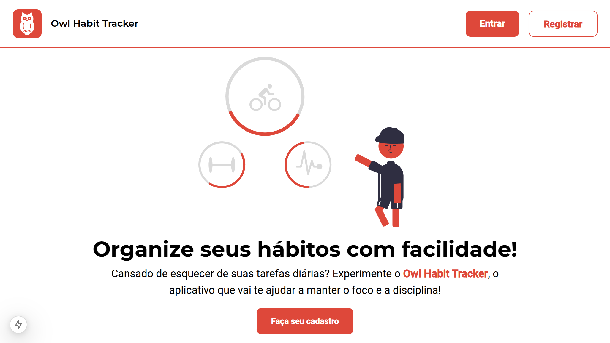
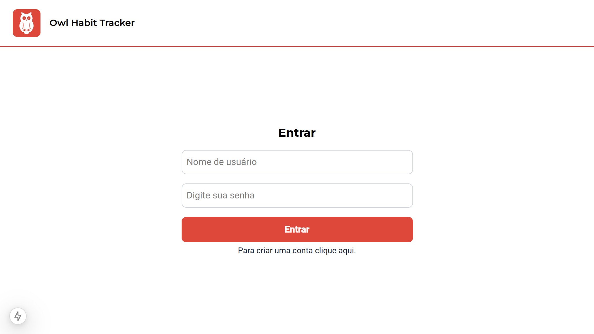
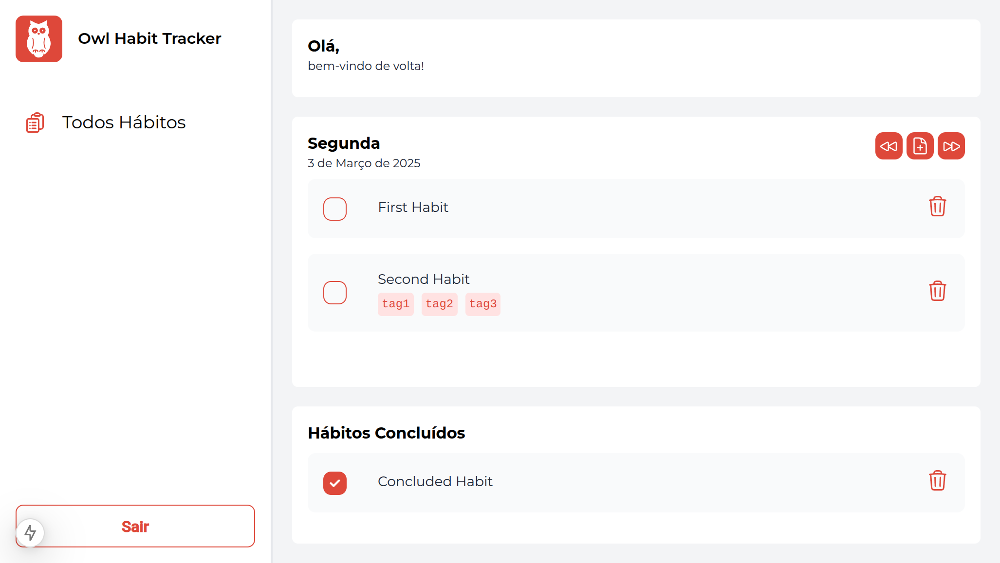

<div align="center"></div>
<h1 align="center">Owl Habit Tracking</h1>

<p align="center">A javascript habit tracker project.</p>

<p align="center">
    <a href="#installing">Installing</a> •
    <a href="#used-techs">Used Technologies</a> •
    <a href="#author">Author</a>
</p>

---

<details>
  <summary>Screenshots</summary>
  
  
  
</details>


<h3 id="installing">Installing</h3>

The easiest way to run this project locally is cloning this repository and run the `make up` command. You will need to install Make, Docker and Docker Compose.

```bash
$ git clone git@github.com:jspereiramoura/habit-tracker-project.git
$ cd habit-tracker-project
$ make up
```

Alternatively, you can run the projects with node using the commands `make dev-up-{projectName}`, but you need to provide a Postgres database to run the API (e.g. using `make dev-up-db`).

---

### Tools and Technologies

#### Common

- **[ESLint](https://eslint.org/):** A static code analyzer that identifies problematic patterns and maintains clean code.
- **[Prettier](http://prettier.io/):** An automatic code formatter that enforces a consistent code style.
- **[TypeScript](https://www.typescriptlang.org/):** A superset of JavaScript that adds static typing, enhancing robustness and maintainability.

#### Frontend

- **[Next.js](https://nextjs.org/):** A React framework offering hybrid rendering and performance optimizations.
- **[Redux Toolkit](https://redux-toolkit.js.org):** A global state management solution with API call caching support, ensuring a predictable architecture.
- **[Tailwind CSS](https://tailwindcss.com/):** A utility-first style framework for rapid and customizable styling.
- **[Vitest](https://vitest.dev/):** A modern testing framework that ensures code integrity through fast and reliable tests.
- **[MSW](https://mswjs.io/):** A tool for mocking API calls during testing, creating realistic test environments without external dependencies.

#### Backend

- **[Nest.js](https://nestjs.com/):** A progressive Node.js framework for building efficient, scalable applications with support for dependency injection and modular architecture.
- **[PostgreSQL](https://www.postgresql.org/):** A reliable and high-performance relational database management system.
- **[TypeORM](https://typeorm.io/):** An ORM that simplifies database interactions by providing an abstraction layer and enhanced security.
- **[Jest](https://jestjs.io/):** A testing framework that ensures backend functionality is thoroughly verified.

#### Deployment

- **Docker:** Containerization.
- **Makefile:** Task automation.

---

<div align="center">
<h3 id="autor">Author</h3>

<strong>José Luiz de Moura Pereira - Front-end Developer</strong>

<div>
  <a href="https://www.linkedin.com/in/jspereiramoura" target="_blank">
    
  </a>
  <a href="mailto:joseluiz.zp@gmail.com">
    
  </a>
  <a href="https://discordapp.com/users/jspereiramoura" target="_blank">
    
  </a>
</div>

</div>